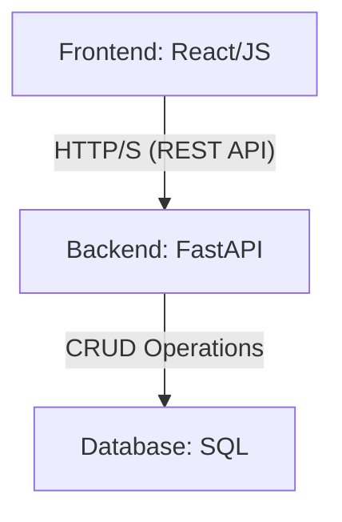

# System Architecture and Design Plan

This document outlines the high-level architecture, database schema, and API design for the Task and Team Management System.

## 1. High-Level Architecture

The system is built on a modern, decoupled architecture:

- **Backend**: A Python-based RESTful API using the **FastAPI** framework. It handles all business logic, data processing, and communication with the database.
- **Frontend**: A simple, lightweight client built with **React** (or clean HTML/CSS/JS). It communicates with the backend via REST API calls.
- **Database**: A relational database (e.g., PostgreSQL or SQLite for development) to store all persistent data. The interaction is abstracted through a service layer.

## 2. Database Schema

The preliminary database schema consists of three core tables: `Users`, `Projects`, and `Tasks`.

### Table: `Users`
- `id`: INTEGER, PRIMARY KEY, AUTOINCREMENT
- `username`: VARCHAR(50), UNIQUE, NOT NULL
- `email`: VARCHAR(120), UNIQUE, NOT NULL
- `hashed_password`: VARCHAR(255), NOT NULL
- `created_at`: TIMESTAMP, DEFAULT CURRENT_TIMESTAMP

### Table: `Projects`
- `id`: INTEGER, PRIMARY KEY, AUTOINCREMENT
- `name`: VARCHAR(100), NOT NULL
- `description`: TEXT
- `owner_id`: INTEGER, FOREIGN KEY (`Users.id`)
- `created_at`: TIMESTAMP, DEFAULT CURRENT_TIMESTAMP

### Table: `Tasks`
- `id`: INTEGER, PRIMARY KEY, AUTOINCREMENT
- `title`: VARCHAR(200), NOT NULL
- `description`: TEXT
- `status`: VARCHAR(20), DEFAULT 'pending' -- (e.g., 'pending', 'in_progress', 'completed')
- `priority`: VARCHAR(20), DEFAULT 'medium' -- (e.g., 'low', 'medium', 'high')
- `project_id`: INTEGER, FOREIGN KEY (`Projects.id`)
- `assignee_id`: INTEGER, FOREIGN KEY (`Users.id`), NULLABLE
- `due_date`: DATE, NULLABLE
- `created_at`: TIMESTAMP, DEFAULT CURRENT_TIMESTAMP

## 3. API Endpoints (FastAPI)

The following RESTful endpoints will be implemented.

### Tasks API (`/api/v1/tasks`)

- **`POST /tasks/`**: Create a new task.
  - **Request Body**: `{ "title": "...", "description": "...", "project_id": 1, ... }`
  - **Response**: `201 Created` with the new task object.

- **`GET /tasks/{task_id}`**: Retrieve a single task by its ID.
  - **Response**: `200 OK` with the task object.

- **`GET /tasks/`**: Retrieve a list of tasks (with filtering options).
  - **Query Params**: `?project_id=1&status=pending&priority=high`
  - **Response**: `200 OK` with an array of task objects.

- **`PUT /tasks/{task_id}`**: Update an existing task.
  - **Request Body**: `{ "title": "Updated title", "status": "in_progress", ... }`
  - **Response**: `200 OK` with the updated task object.

- **`DELETE /tasks/{task_id}`**: Delete a task.
  - **Response**: `204 No Content`.

Further endpoints for `Users` and `Projects` will be designed following a similar RESTful pattern.
